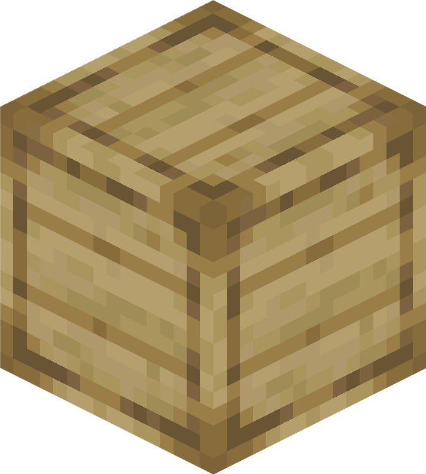

<h1 align="center">Create: Interiors</h1>

   
   
   
    
   
   
   <!---->

<h3>Create: Interiors is an addon for Create that extends Create's furnishing options. </h3>
   

<h1>Current list of features:</h1>

<ul>

   <li>Chair Blocks
      <ul>
         <li>Come in all 16 Minecraft Dye Colors</li>
		<li>Right-click with Wrench to switch armrest state</li>
         <li>Sneak + Right-Click a wrench to toggle back size</li>
         <li>Can be crafted either from 1 Colored Wool, 1 Wooden Plank and 1 Wooden Slab OR from 1 Colored Seat and 1 Wooden Plank</li>
         <li>Can be sat on, both as a part of contraptions and standalone</li>
         <li>Can pick up entities just like Seat blocks</li>
      </ul>
      
        
   </li>
      <li>Floor Chair Blocks
      <ul>
         <li>Have the same functionality as the Chair blocks, but without legs</li>
         <li>Can be crafted either from 1 Colored Wool and 2 Wooden Slabs OR from 1 Colored Seat and 1 Wooden Slab</li>
           
      </ul>
   </li>
  <li>Kelp Seat
  <ul>
      <li>Cheaper & easier-to-farm alternative to wool seats</li>
      <li>Can be crafted from 1 Dried Kelp item and 1 Wooden Slab</li>
      <li>Work exactly like Create's seat blocks</li>
   </ul> 
   ⠀⠀⠀⠀  
   <li>Kelp Chair/Floor Chair
     <ul>
      <li>Cheaper & easier-to-farm alternative to wool chairs</li>
   </ul> 
   ⠀⠀⠀  
   </li>

   <li>Seatwood Planks
     <ul>
      <li>Useful together with Copycat Steps & Copycat Panels as a decoration for Seats & Chairs</li>
      <li>3 Seatwood Planks can be crafted from 2 Wooden Slabs and 2 Wooden Planks</li>
   </ul> 
   ⠀⠀⠀⠀
       
      ⠀⠀⠀⠀⠀⠀⠀⠀⠀⠀⠀⠀⠀⠀<i>Seatwood Tray Tables</i>
   </li>
   <li>Wall-Attached Table
     <ul>
      <li>Small table that works well with the Chair blocks</li>
   </ul> 
   ⠀⠀⠀⠀⠀
   </li>

</ul>

---

# Contributions

### Massive thanks to [rdh](https://github.com/rhysdh540) for all his critical contributions!

### Thanks to [Luna](https://github.com/LopyLuna) for the wonderful logo :)

## Translating 🥳

**Thanks to [@AsseyGithub](https://github.com/AsseyGithub) for translating Create: Interiors to Korean.** 🎉

**Thanks to [@rim4oo](https://github.com/rim4oo) for translating Create: Interiors to Russian.** 🎉

Create: Interiors is currently available in English, German, Swedish, Russian and Korean. If you don't see your language and want to help, please do feel free! It's much appreciated.

### Bug reports, suggestions and ideas

Bug reports, suggestions and ideas are incredibly useful and much appreciated. A GitHub issue or an email are both great ways to get in contact.

---

   <h3>Find Create: Interiors on <a href="https://modrinth.com/mod/interiors"> Modrinth</a> or <a href="https://legacy.curseforge.com/minecraft/mc-mods/interiors"> CurseForge</a>
  

Report Issues <a href="https://github.com/sudolev/CreateInteriorsMod/issues">here</a></h3>

<b>This project is licensed under <a href="https://www.gnu.org/licenses/gpl-3.0.en.html#license-text" target="_blank">GPL-3.0</a>

© 2023 Sudolev</b>

